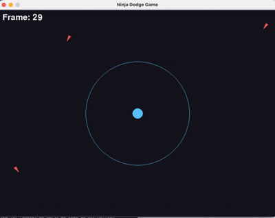

# AA228-CS238-Ninja-Agent-Final-Project

<p align="center">
  <figure>
    
    <figcaption><em>Demo of the MDP Agent evading arrows in a partially observable environment.</em></figcaption>
  </figure>
</p>
This repository contains the code for the final project "The Art of Evasion: Training a Ninja Agent under Partial Observability".

## Project Members
* Jaduk Suh
* Juhyun Jung

## Install Dependencies
```
pip install -r requirements.txt
```

## Playing the game
```
python -m src.main
```

## Running the random agent
```
python -m agents.random_agent -r
```

Note that the -r flag enables rendering. Without it, the game will run but it will not be rendered.

## Running the DQN agent
```
python -m agents.run_nn_agent -r
```

## Running the MDP agent
```
python -m agents.run_mdp_agent -r
```